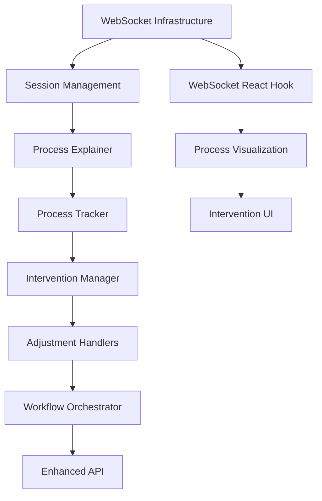

# Modular Implementation Plan for Enhanced CV Screening v1.1

## Overview
This document outlines a modular approach to implementing the v1.1 enhancements with real-time process visualization, human-in-the-loop controls, and transparency features.

## Implementation Phases

### Phase 1: Core Infrastructure Setup

#### Module 1.1: WebSocket Infrastructure
**Purpose**: Enable real-time bidirectional communication between backend and frontend

**Components**:
```python
# app/services/websocket_manager.py
- WebSocketManager: Handles connection lifecycle
- ConnectionPool: Manages multiple client connections
- MessageBroadcaster: Sends updates to connected clients
```

**Integration Points**:
- Modify `app/main.py` to add WebSocket endpoints
- Create session management for WebSocket connections
- Add WebSocket middleware for authentication

**Implementation Steps**:
1. Create `app/services/websocket_manager.py`
2. Add WebSocket endpoint to FastAPI app
3. Implement connection pooling
4. Create message routing system

#### Module 1.2: Enhanced Session Management
**Purpose**: Track analysis sessions across WebSocket and REST endpoints

**Components**:
```python
# app/services/session_manager.py
- SessionManager: Tracks active sessions
- SessionStore: Redis-based session storage
- SessionState: Maintains analysis state
```

**Integration Points**:
- Integrate with existing session_id system
- Add Redis connection pool
- Modify existing endpoints to use enhanced sessions

### Phase 2: Process Explanation Engine

#### Module 2.1: Process Explainer Core
**Purpose**: Generate human-readable explanations for each AI processing step

**Components**:
```python
# app/explainers/process_explainer.py
- ProcessExplainer: Main explanation engine
- ExplanationTemplates: Human-friendly message templates
- ConfidenceCalculator: Calculates confidence scores
```

**Integration Points**:
- Hook into `enhanced_cv_processor.py`
- Integrate with existing scoring methods
- Connect to WebSocket broadcaster

**Implementation Steps**:
1. Create explanation template system
2. Build confidence scoring algorithms
3. Implement step tracking
4. Add explanation generation logic

#### Module 2.2: Process Step Tracker
**Purpose**: Track and log each step of the CV analysis process

**Components**:
```python
# app/services/process_tracker.py
- ProcessTracker: Logs each analysis step
- StepDefinitions: Predefined analysis steps
- ProcessTimeline: Maintains chronological order
```

### Phase 3: Human-in-the-Loop System

#### Module 3.1: Intervention Points
**Purpose**: Define where humans can intervene in the process

**Components**:
```python
# app/services/intervention_manager.py
- InterventionManager: Handles intervention requests
- InterventionPoints: Predefined intervention locations
- DecisionValidator: Validates human decisions
```

**Integration Points**:
- Add to CV processing workflow
- Create intervention API endpoints
- Connect to WebSocket for real-time updates

#### Module 3.2: Adjustment Handlers
**Purpose**: Process human adjustments to AI decisions

**Components**:
```python
# app/services/adjustment_handlers.py
- KeywordAdjuster: Modify keyword priorities
- ScoreAdjuster: Adjust scoring weights
- PatternValidator: Confirm/reject patterns
```

### Phase 4: Frontend Real-Time Components

#### Module 4.1: WebSocket React Hook
**Purpose**: Manage WebSocket connections in React

**Components**:
```typescript
// frontend/hooks/useWebSocket.ts
- useWebSocket: Custom hook for WebSocket
- WebSocketProvider: Context provider
- MessageHandler: Process incoming messages
```

#### Module 4.2: Process Visualization Components
**Purpose**: Display real-time process updates

**Components**:
```typescript
// frontend/components/ProcessVisualization/
- ProcessTimeline: Shows analysis progress
- StepCard: Individual process step display
- ConfidenceIndicator: Visual confidence display
- InterventionPanel: Human control interface
```

### Phase 5: Integration Layer

#### Module 5.1: Workflow Orchestrator
**Purpose**: Coordinate all modules during CV analysis

**Components**:
```python
# app/workflows/enhanced_workflow.py
- EnhancedWorkflow: Main orchestration class
- StepCoordinator: Manages process steps
- ResultAggregator: Combines all analysis results
```

#### Module 5.2: API Gateway Updates
**Purpose**: Update existing endpoints for real-time features

**Updates Required**:
- Add WebSocket session initialization to `/api/analyze-enhanced`
- Create intervention endpoints
- Add real-time status endpoints

## Implementation Timeline

### Week 1-2: Infrastructure Setup
- [ ] Implement WebSocket manager
- [ ] Set up Redis for session storage
- [ ] Create basic message routing
- [ ] Test WebSocket connections

### Week 3-4: Process Explanation Engine
- [ ] Build explanation templates
- [ ] Implement confidence scoring
- [ ] Create process tracker
- [ ] Test explanation generation

### Week 5-6: Human-in-the-Loop
- [ ] Define intervention points
- [ ] Create adjustment handlers
- [ ] Build validation logic
- [ ] Test intervention flow

### Week 7-8: Frontend Components
- [ ] Create WebSocket hook
- [ ] Build process visualization
- [ ] Implement intervention UI
- [ ] Test real-time updates

### Week 9-10: Integration & Testing
- [ ] Integrate all modules
- [ ] End-to-end testing
- [ ] Performance optimization
- [ ] Documentation

## Module Dependencies



## Testing Strategy

### Unit Tests
- Test each module independently
- Mock external dependencies
- Focus on edge cases

### Integration Tests
- Test module interactions
- Verify WebSocket communication
- Test intervention workflows

### End-to-End Tests
- Full CV analysis flow
- Real-time update verification
- Human intervention scenarios

## Rollback Strategy

Each module is designed to be:
1. **Independent**: Can be disabled without breaking core functionality
2. **Backward Compatible**: Existing API remains functional
3. **Feature Flagged**: Can toggle v1.1 features on/off

## Success Metrics

1. **Real-time Performance**: < 100ms latency for updates
2. **Intervention Success**: 95% successful human interventions
3. **Explanation Quality**: User satisfaction > 4.5/5
4. **System Stability**: 99.9% uptime with new features

## Next Steps

1. Review and approve implementation plan
2. Set up development environment
3. Begin Phase 1 implementation
4. Create detailed technical specifications for each module